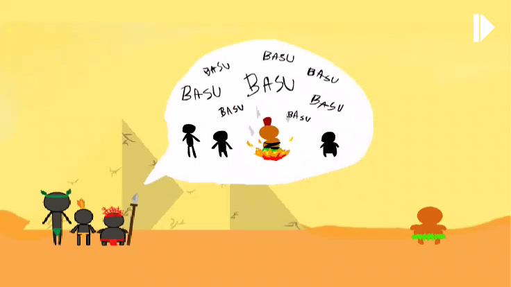
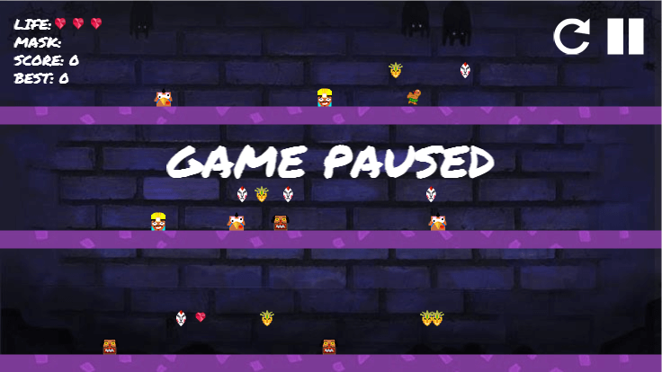

# jam-2016-remake

- The re-implementation of the game "KiKi - The Sacrifice" from GGJ2016 by using Godot Engine.
- Aim for port this game to Andriod, Window and Linux.
- [Original Repository](https://github.com/jojoee/jam-2016)

## Our Team
+ J - [Jirashy G. Kongjinda](https://www.facebook.com/LAWGGEVOL) / [Joe Nathachai Thongniran](https://www.facebook.com/joenathachai.thongniran)
+ A - [Anisa Jaiteam](https://www.facebook.com/anisa.jaiteam)
+ M - [Munchupa Lerkprasertkul](https://www.facebook.com/yuyu.lovemom)
+ [Chatchai Saratakij](csaratakij@gmail.com)
+ [Sahapat Tong-on](https://www.facebook.com/sahapat.tongon)

## TODO
- All info is in this repo's project management board.

## 3rd party's assets
- Sound: [lessmilk.com](http://www.lessmilk.com/),[super-coin-box](https://github.com/dmaslov/super-coin-box)
- Font: [Permanent Marker](https://www.google.com/fonts/specimen/Permanent+Marker)
